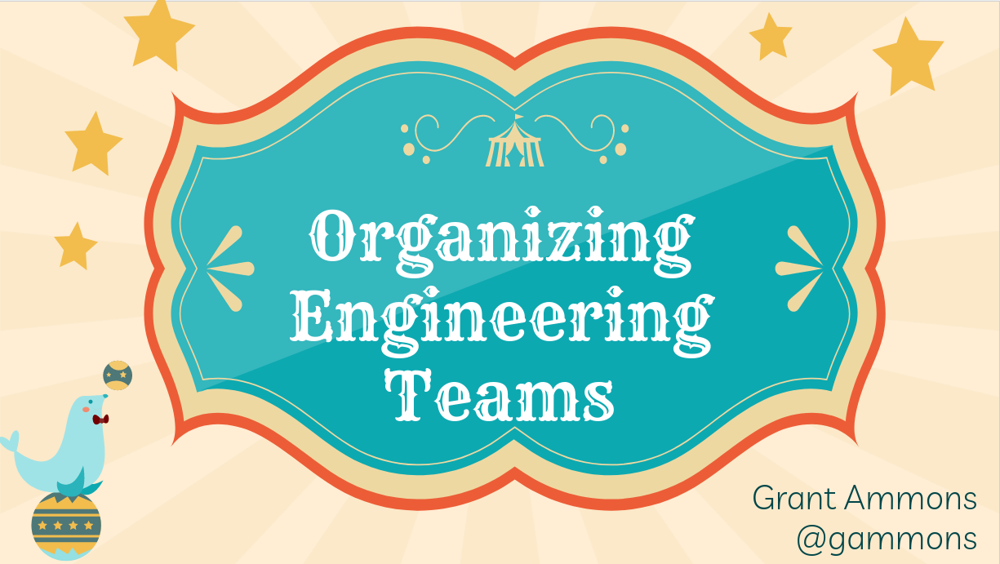
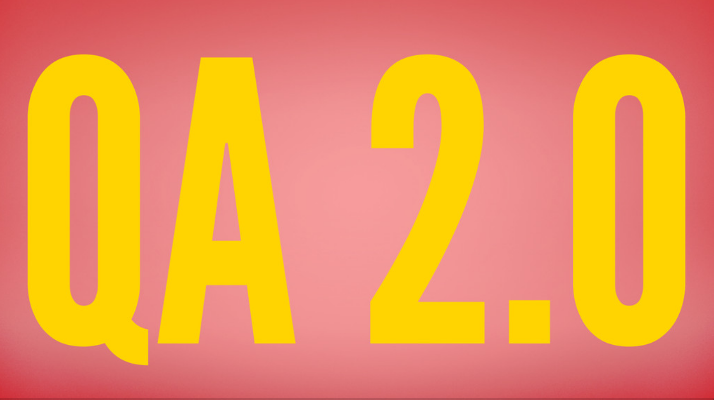

## [Organizing Engineering Teams](https://speakerdeck.com/gammons/organizing-engineering-teams)

As your company grows, team organization will become more important to ensure success. In this presentation, I talked about strategies for how to structure an engineering organization into successful teams.

I talked about when and how to reorg, the principles that go into creating highly functional teams, management structures, and rollout considerations.

---

## [Ditching scrum for kanban](https://speakerdeck.com/gammons/ditching-scrum-for-kanban)

I gave a presentation and fireside chat at [CTO School NYC](http://www.meetup.com/ctoschool) about evolving our software development process at PipelineDeals. This talk was based upon my [blog post](https://medium.com/cto-school/ditching-scrum-for-kanban-the-best-decision-we-ve-made-as-a-team-cd1167014a6f#.9nu7criuh) about the same subject.

---

## [QA 2.0](https://speakerdeck.com/gammons/qa-2-dot-0)

I gave a talk about QA at [CTO School Philadelphia](http://www.meetup.com/CTO-School-Philadelphia/). QA is an interesting subject when it comes to development teams because every team needs it, but they all do it slightly differently. There are, however some general principles that make up having effective QA in an organization.

---

## [How Bitcoin works](https://speakerdeck.com/gammons/how-bitcoin-works)

In 2014 I gave a talk about how Bitcoin works at [PhillyRB](http://www.phillyrb.org/).
